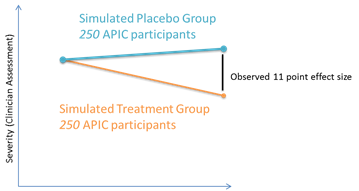
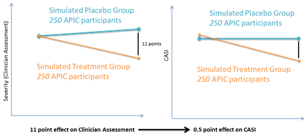
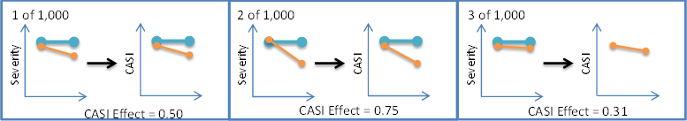

# Overview
This repository serves as supplemental material for the Composite Asthma Severity Index (CASI) Letter to the Editor, entitled *Minimally Important Differences and Risk Levels for the Composite Asthma Severity Index*. CASI is a quantitative measure of asthma severity that was introduced in the Journal of Allergy and Clinical Immunology in March 2012 ([link](http://www.jacionline.org/article/S0091-6749(11)02930-7/pdf)). More information about CASI is found at [asthmaseverity.org](http://www.asthmaseverity.org). 

The follow-up letter expands upon the inital report by comparing the CASI to a the gold standard measure of asthma severity - clinician assessment. Using that gold standard, we establish risk levels for CASI and calculate other useful parameters such as the minimally important difference (MID) and minimally important effect size. This repository describes the methods and code used to derive the minimally important effect size.  Results are presented in the csv files.

# Minimally important effect size simulation methods
Since APIC was an single-group observation study (i.e. no treatment or placebo group), we could not directly assess a between-group treatment effects for CASI and physician clinician assessments to determine a minimally important effect size. Instead we performed a statistical simulation that created and compared simulated treatment arms using APIC data. The steps for the simulation using 250 participants per treatment arm are listed below and illustrated in **Supplemental Figure 1**:

1. Establish a target minimally important effect of 10 points using the gold standard variable (clinician assessment of severity), corresponding to the anchors in the MID analysis.

2. Simulate 2 groups of APIC participants (“Treatment” and “Placebo”) with a difference in treatment effect for physician clinician assessment (delta-delta) of approximately 10 points (**Supplemental Figure 1a**).

  2a. Pick a random APIC participant for the simulated Placebo Group.

  2b. Pick a second APIC participant with similar baseline severity and lower severity at end of study severity (maximum of 30 points lower) for the simulated Treatment Group.

  2c. Repeat 2a and 2b until you have simulated groups with the desired sample size (e.g.  250 participants per group).

  2d. Compare baseline severity between groups; if the groups are different (*p>0.10*), discard the simulation.

  2e. Compare the end of study severity between groups; if the treatment effect is not close to the desired minimally important effect  (greater than 8 and less than 12, *p>0.10 for each*) discard the simulation.

3. Calculate the corresponding CASI effect (delta-delta) for the groups from step 2 (**Supplemental Figure 1b**).

4. Repeat steps 2 and 3 1,000 times and calculate the median CASI effect size with a simulated 95% confidence interval (**Supplemental Figure 1c**).

The resulting median value from this simulation serves as an estimate for the minimally important effect size for CASI. Full code and reusable macro are included in this repository.

**Supplemental Figure 1 - Methodology for sMID Statistical Simulation**

Panel A - Simulated Treatment arms using APIC participants.  Effect is calculated using gold standard.

Panel B - Effect for CASI is calculated using the same simulated treatment arms.

Panel C - Process is repeated 1,000 times to determine the study-level minimal important difference.

